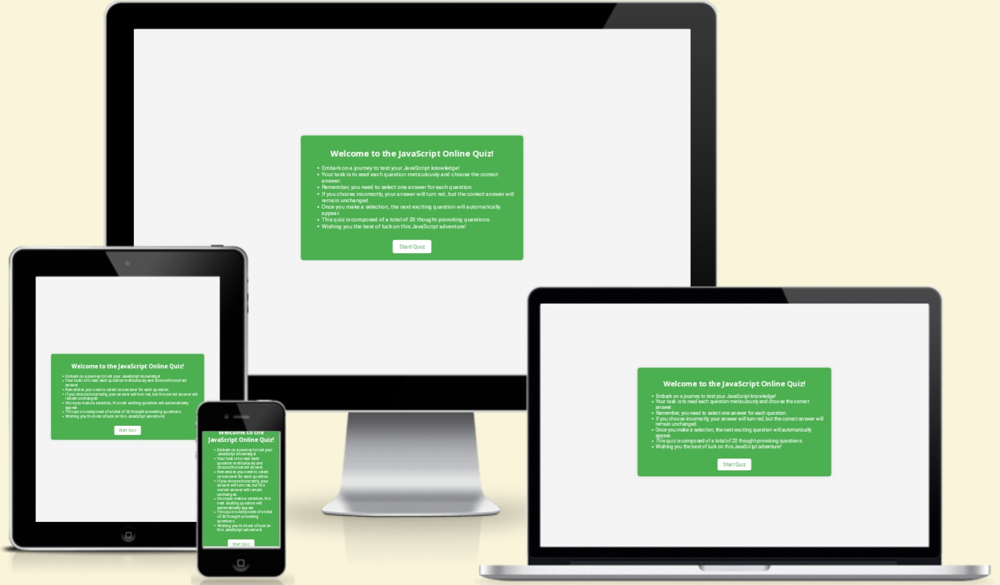

# JavaScript Online Quiz

This quiz is a dynamic and engaging platform designed to evaluate your proficiency in JavaScript, a powerful programming language widely used in web development. Whether you are a coding enthusiast, a student, or a seasoned developer, this quiz offers an opportunity to test and enhance your knowledge in a fun and interactive way.
Dive into a series of thought-provoking questions that cover various aspects of JavaScript, from basic concepts to advanced functionalities. As you progress through the quiz, each question is crafted to challenge and deepen your understanding of this fundamental language.

The live link can be found here - [JavaScript Online Quiz](https://saraabbasinz.github.io/online-quiz/)

## Site Owner Goals
- Create a dynamic platform where users can actively participate in a JavaScript quiz, turning learning into an engaging experience.
- Allow users to evaluate their grasp of JavaScript concepts by navigating through the quiz, gaining insights into their strengths and areas for improvement.
- Introduce an entertaining element with a timer, challenging users to not only answer questions correctly but also do so swiftly, making the learning process more enjoyable.
- Provide users with immediate feedback on their performance, displaying the time taken and their score. This quick response enhances user engagement and motivates improvement.
- Whether you're a JavaScript pro or just starting, the goal is to entice you to return, beat your own score, and enjoy the learning process in a lighthearted way.

## User Stories

- ### First Time User
- As a first-time user, I want to understand the purpose of the website.
- As a first-time user, I want to easily navigate through the quiz, understand the questions, and submit my answers effortlessly.
- As a first-time user, once I finish the quiz, I want a summary of my performance and a clear indication that the quiz is complete.

- ### Returning User
- As a returning user, I want mmediate access to the quiz without unnecessary steps.
- As a returning user, I want to discover and explore additional quiz features or new challenges.
- As a returning user, I want to participate in time-based challenges to compete with self or others.

- ### Frequent User
- As a frequent user, I want to engage in a daily quick quiz challenge for regular mental stimulation.
- As a frequest user, I want to stay updated with new quiz content or additional features regularly.
- As a frequent user, I want to set personal records and strive for faster completion times.

## Design
