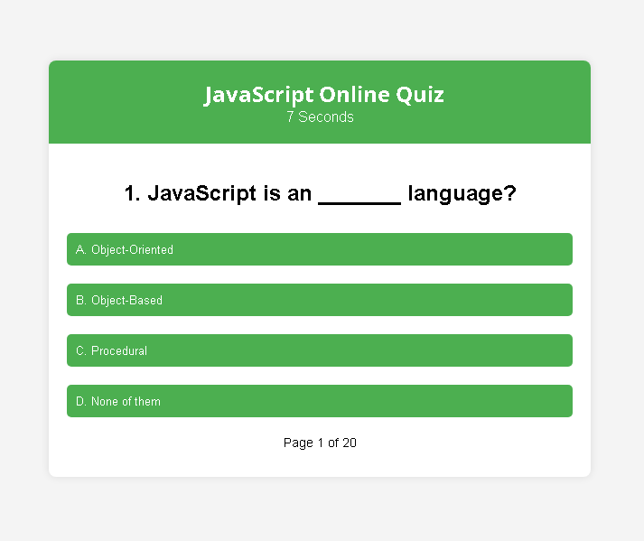
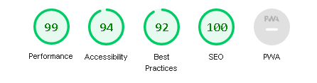
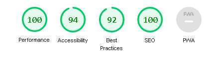

# JavaScript Online Quiz

This quiz is a dynamic and engaging platform designed to evaluate your proficiency in JavaScript, a powerful programming language widely used in web development. Whether you are a coding enthusiast, a student, or a seasoned developer, this quiz offers an opportunity to test and enhance your knowledge in a fun and interactive way.
Dive into a series of thought-provoking questions that cover various aspects of JavaScript, from basic concepts to advanced functionalities. As you progress through the quiz, each question is crafted to challenge and deepen your understanding of this fundamental language.

The live link can be found here - [JavaScript Online Quiz](https://saraabbasinz.github.io/online-quiz/)

## Site Owner Goals
- Create a dynamic platform where users can actively participate in a JavaScript quiz, turning learning into an engaging experience.
- Allow users to evaluate their grasp of JavaScript concepts by navigating through the quiz, gaining insights into their strengths and areas for improvement.
- Introduce an entertaining element with a timer, challenging users to not only answer questions correctly but also do so swiftly, making the learning process more enjoyable.
- Provide users with immediate feedback on their performance, displaying the time taken and their score. This quick response enhances user engagement and motivates improvement.
- Whether you're a JavaScript pro or just starting, the goal is to entice you to return, beat your own score, and enjoy the learning process in a lighthearted way.

## User Stories

- ### First Time User
  - As a first-time user, I want to understand the purpose of the website.
  - As a first-time user, I want to easily navigate through the quiz, understand the questions, and submit my answers effortlessly.
  - As a first-time user, once I finish the quiz, I want a summary of my performance and a clear indication that the quiz is complete.

- ### Returning User
  - As a returning user, I want mmediate access to the quiz without unnecessary steps.
  - As a returning user, I want to discover and explore additional quiz features or new challenges.
  - As a returning user, I want to participate in time-based challenges to compete with self or others.

- ### Frequent User
  - As a frequent user, I want to engage in a daily quick quiz challenge for regular mental stimulation.
  - As a frequest user, I want to stay updated with new quiz content or additional features regularly.
  - As a frequent user, I want to set personal records and strive for faster completion times.

## Design

### Imagery
- Used a color scheme that balances professionalism with a touch of vibrancy to maintain a visually inviting atmosphere.
- Integrate JavaScript-related icons to emphasize the quiz's programming theme.
- Ensure a clean layout that enhances readability and user focus on quiz content

### Color
The color design for the JavaScript Online Quiz is carefully chosen to enhance the user experience. A neutral background (#f4f4f4) provides a clean canvas, while the main container and header use a white background (#fff) with vibrant green accents (#4caf50) for clarity and visual appeal. The use of green for buttons and highlights maintains a cohesive theme throughout the quiz, creating a sense of unity and guiding the user's interaction. The color scheme aims to be both aesthetically pleasing and functional, ensuring a seamless and enjoyable experience for participants.

### Fonts
The chosen font for the JavaScript Online Quiz, 'Open Sans', contributes to a modern and clean visual style. This sans-serif typeface is utilized to provide clear and easily readable text throughout the quiz.

### Layout
The site is a single page with 3 sections:
  - Welcome area and guide
  - Quiz selection area
  - Quiz complete and score

### Desktop Wireframe
Wireframes were produced using Balsamiq.

 
Desktop Wireframe

 

    
Mobile Wireframe

 

## Feature

### Quiz Guide
- Begin your JavaScript quiz with a helpful guide offering clear instructions.
- Understand the requirement to select a single answer per question for a streamlined experience.

### Quiz Selection
- Engage with 20 well-crafted questions designed to evaluate your JavaScript knowledge.
- Experience a variety of question formats with multiple options, encouraging careful consideration.
- Seamlessly transition between questions, ensuring a smooth and user-friendly quiz experience.
- Focus on answering questions without disruptions, enhancing overall engagement.
- Feel the thrill of a time challenge with a built-in timer tracking your quiz duration.
- Test not just your knowledge but also your ability to respond swiftly.

### Wrong Answer
Receive immediate feedback on your responses, with incorrect answers visibly highlighted in red.

### Quiz Result 
- Explore a dedicated results section providing an overview of your performance.
- Receive a personalized message based on your score, offering encouragement or motivation.
- Enjoy the flexibility of a restart option, allowing you to retake the quiz and enhance your score.
- Turn the quiz into a learning journey, identifying areas for improvement and mastering JavaScript concepts.

### Features Left to Implement
- Introduce user accounts to allow individuals to track their progress over multiple quiz sessions.
- Provide users with the ability to customize quiz settings, such as adjusting difficulty levels or selecting specific topics.
- Integrate social media features to enable users to share their quiz results and achievements.
- Enhance the learning experience by incorporating detailed explanations for both correct and incorrect answers.
- Implement a leaderboard functionality to foster friendly competition among quiz-takers.

## Testing

### Validator Testing

- #### HTML
  - No errors were returned when passing through the official W3C Markup Validator
      - [W3C Validator Results](https://validator.w3.org/nu/?doc=https%3A%2F%2Fsaraabbasinz.github.io%2Fonline-quiz%2F)

- #### CSS
  - No errors were found when passing through the official W3C CSS Validator
      - [W3C CSS Validator Results](https://jigsaw.w3.org/css-validator/validator)

- #### Javascript
  - No errors or warnings were returned when passing through the the [JSHint Validator](https://jshint.com/)

  

  
### Accessibility 
- The site achieved a Lighthouse accessibility score of 99% and 95% on both mobile and desktop which confirms that the colours and fonts chosen are easy to read and accessible

Mobile Lighthouse Score

Desktop Lighthouse Score

### Button Testing
- All buttons were tested manually to ensure the user is directed to the correct section of the website and functions run as intended.

### Quiz Testing
- The quiz was thoroughly tested by friends and family to ensure that everything worked as intended including the following:
  - We validate that each quiz question is accurately displayed, users can select only one answer per question, and feedback mechanisms function correctly.
  - We verify the smooth transition between quiz questions and the effectiveness of the restart button.
  - The timer is rigorously tested to accurately reflect the time spent on the quiz, ensuring precision and reliability.
  - We confirm that scores are calculated correctly based on user answers.

### Browser Testing
- The Website was tested on Google Chrome, Firefox, Microsoft Edge, Safari browsers with no issues noted.

### Device Testing
- The website was viewed on a variety of devices such as Desktop, Laptop, iPhone 8, iPhoneX and iPad to ensure responsiveness on various screen sizes in both portrait and landscape mode. The website performed as intended. The responsive design was also checked using Chrome developer tools across multiple devices with structural integrity holding for the various sizes.
- I also used the following website to test responsiveness:
  - [Responsinator](http://www.responsinator.com/?url=https%3A%2F%2Fsaraabbasinz.github.io%2Fonline-quiz%2F)

### Fixed Bugs

#### Fixed Timer Display Issue
- Previously, the quiz timer was not updating in real-time, leading to inaccurate time tracking during the quiz. Users couldn't rely on the displayed timer to gauge how much time they had spent.
- To resolve this, the JavaScript code responsible for updating the timer was revised. Now, the timer accurately reflects the elapsed time from the start of the quiz. The setInterval function is utilized to consistently update the timer display, providing users with an authentic representation of their quiz duration.

#### Resolved Incorrect Scoring:
- Users reported instances where their correct answers were not consistently contributing to their final quiz score. This inconsistency raised concerns about the accuracy of the quiz scoring system.
- A comprehensive examination of the scoring logic was undertaken. It was discovered that a conditional statement was not effectively capturing and tallying all correct responses. The logic was revised to ensure that each correct answer consistently adds to the user's score. This adjustment guarantees a reliable and accurate reflection of the user's knowledge in the final quiz score.

### Known Bugs

There are no known bugs.

## Technologies Used

### Languages

- JavaScript
- HTML5
- CSS3

### Frameworks - Libraries - Programs Used
- [Am I Responsive](http://ami.responsivedesign.is/) - Used to verify responsiveness of website on different devices.
- [Responsinator](http://www.responsinator.com/) - Used to verify responsiveness of website on different devices.
- [Balsamiq](https://balsamiq.com/) - Used to generate Wireframe images.
- [Chrome Dev Tools](https://developer.chrome.com/docs/devtools/) - Used for overall development and tweaking, including testing responsiveness and performance.
- [Font Awesome](https://fontawesome.com/) - Used for icons in information bar.
- [GitHub](https://github.com/) - Used for version control and hosting.
- [Google Fonts](https://fonts.google.com/) - Used to import and alter fonts on the page.
- [TinyPNG](https://tinypng.com/) - Used to compress images to reduce file size without a reduction in quality.
- [W3C](https://www.w3.org/) - Used for HTML & CSS Validation.

## Deployment

The site was deployed using GitHub pages. The steps to deploy using GitHub pages are:

1. Go to the repository on GitHub.com
2. Select 'Settings' near the top of the page.
3. Select 'Pages' from the menu bar on the left of the page.
4. Under 'Source' select the 'Branch' dropdown menu and select the main branch.
5. Once selected, click the 'Save'.
6. Deployment should be confirmed by a message on a green background saying "Your site is published at" followed by the web address.

The live link can be found here - [JavaScript Online Quiz](https://saraabbasinz.github.io/online-quiz/)

## Credit

This JavaScript Online Quiz project drew inspiration from various sources, contributing to its development and features.

### Resources Used

- [JavaScript questions with Answers](https://www.interviewbit.com/javascript-mcq/#javascript-is-an-_______-language)
- [Drawing inspiration from a YouTube tutorial](https://youtube.com/watch?v=pQr4O1OITJo&amp;si=jIKajE-WKlhQmeCn)

## Acknowledgments

My mentor Antonio for his support and advice.

The Code Institute slack community for their quick responses and very helpful feedback!
